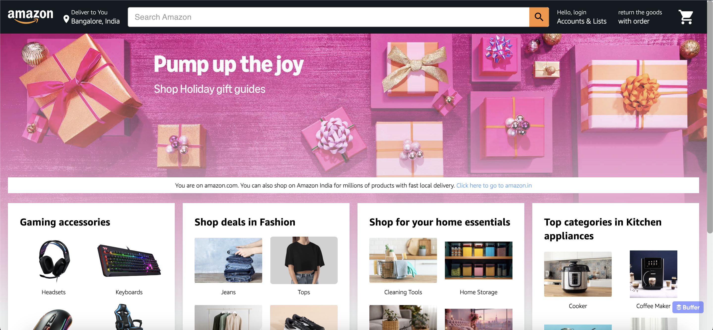
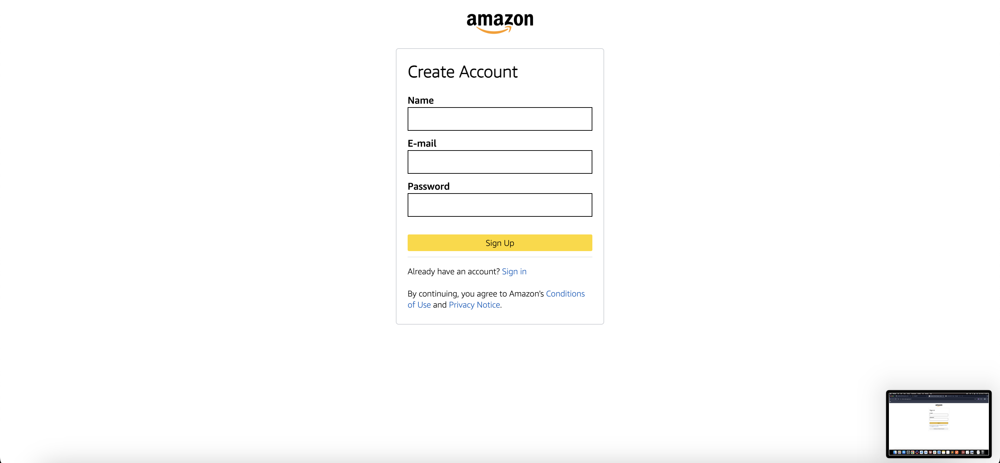
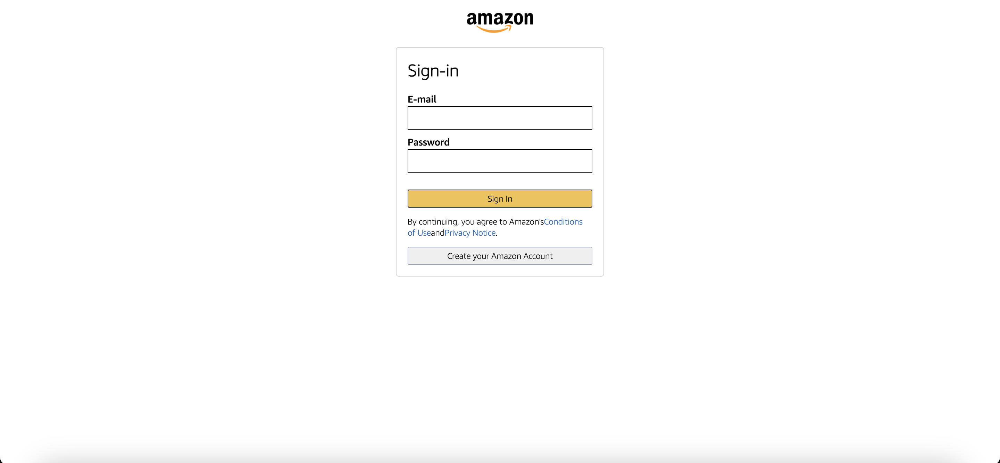
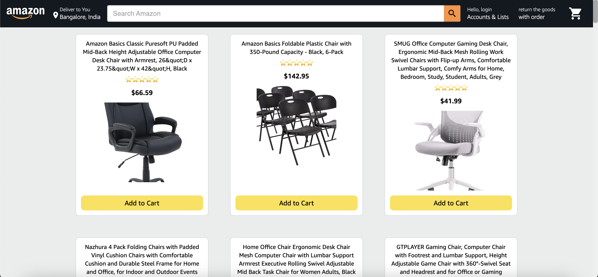
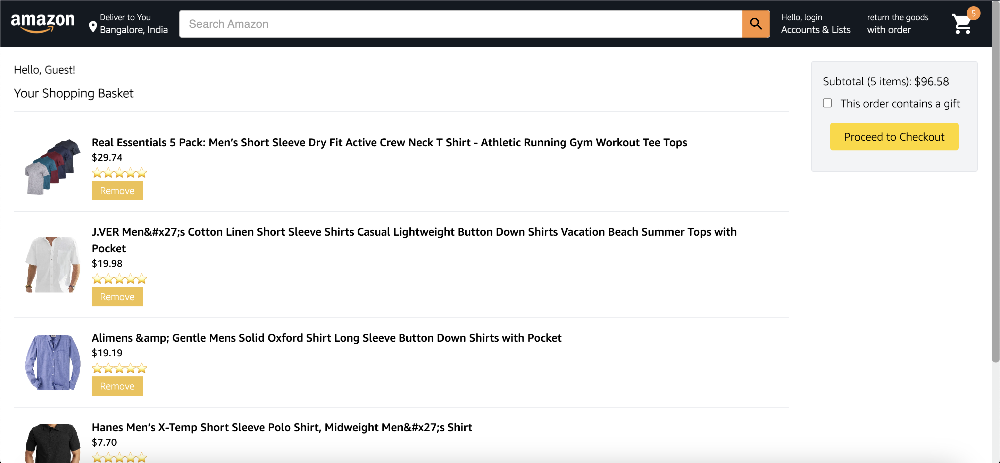

# Amazon Clone Project

This is a frontend-only clone of the popular e-commerce website Amazon. The project showcases key features of an e-commerce platform like product listings, search functionality, and a shopping cart system. The data is mocked or stored locally for demonstration purposes.

Project Link : https://rb--clone.web.app/


## Features

- __Product Listing:__ Display of products with details such as images, prices, and descriptions.

- __Shopping Cart:__ Users can add, remove, and update items in their cart.

- __User Interface:__ Interactive and easy-to-use layout built with modern web technologies.

- __User Authentication:__ Login and signup system using Firebase Authentication for secure user management.
## Tech Stack

- React.js (for building dynamic and interactive UI)
- Firebase Hosting
- Firebase Auth (for user login/signup)
- React-Dom
- Vite (for fast build and development setup)


## Installation

### Prerequisites
Before getting started, ensure you have the following installed on your system:

- Node.js: Version 14.x or higher
- npm: Package manager for JavaScript (usually comes with Node.js)

### 1. Clone the repository
Start by cloning the project to your local machine:
``` 
https://github.com/iamrupambiswas/amazon-clone.git
cd amazon-clone
```

### 2. Install dependencies
This project uses Vite as the build tool, which is faster than traditional bundlers like Webpack. To install the project dependencies, run:

```
npm install
```

### 3. Set up Firebase
- Create a Firebase project in the Firebase Console.
- Enable Firebase Authentication by going to the "Authentication" tab in the Firebase Console and enabling Email/Password login.
- Obtain your Firebase config keys by going to the "Project Settings" in the Firebase Console.
- Create a .env file in the root of your project and add your Firebase config keys like so:
```
VITE_FIREBASE_API_KEY=your-api-key
VITE_FIREBASE_AUTH_DOMAIN=your-auth-domain
VITE_FIREBASE_PROJECT_ID=your-project-id
VITE_FIREBASE_STORAGE_BUCKET=your-storage-bucket
VITE_FIREBASE_MESSAGING_SENDER_ID=your-messaging-sender-id
VITE_FIREBASE_APP_ID=your-app-id
```

### 4. Run the project
Once everything is set up, you can start the development server using the following command:
```
npm run dev
```
This will start the Vite development server, and the application will be accessible at http://localhost:5173 (default port for Vite).

## Screenshots
__1. HomePage__



__2. Sign-up page__



__3. Login page__



__4. Product Page__



__5. Cart Page__



## Contributing
Feel free to fork this project and submit pull requests. If you have any issues or suggestions for improvements, please open an issue in the GitHub repository.
## Connect with me

- LinkedIn: [Rupam Biswas](https://www.linkedin.com/in/iamrupambiswas/)
- Twitter: [RupamBiswas](https://x.com/iam_rupambiswas)

---
This version is optimized for a Vite React project setup and includes clear installation steps. Be sure to replace placeholders with your actual Firebase credentials in the .env file, and everything should be ready to go.